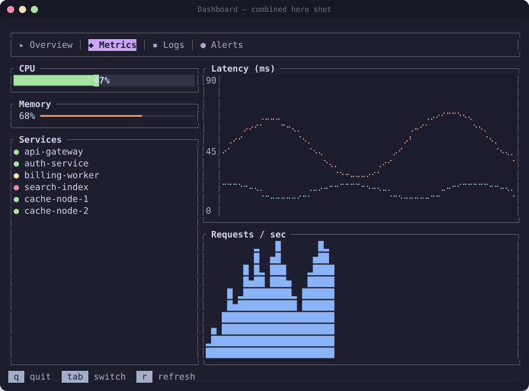

# Making it actually look good

Fifteen concrete techniques, mined from real source in 22 showcase apps
(`~/Dev/others/ratatui-apps/`, full citations in `reference/showcase-apps.md`) plus this skill's
own `examples/` gallery. Screenshot first, then the technique — see it before you read about it.



That hero shot combines nearly everything below: a themed `Tabs` bar, `Gauge` + `LineGauge`
meters, a colored-dot status `List`, a two-series `Chart`, a `Sparkline`, and a keybinding help
bar — all through one `Theme` struct, one consistent `Rounded` border convention, and deliberate
margins. Source: `examples/src/scenes.rs::dashboard`.

## 1. A dedicated `Theme` struct, threaded everywhere

Never call `Color::Rgb(...)`/`Color::Red` ad hoc inside render code. Define semantic fields once:

```rust
// examples/src/theme.rs
pub struct Theme { pub base: Color, pub text: Color, pub accent: Color, pub green: Color, /* … */ }
pub const THEME: Theme = Theme { base: Color::Rgb(0x1e,0x1e,0x2e), /* … */ };
```

`gitui` calls this pattern `SharedTheme` (`Rc<Theme>`, ~20 fields, loaded from RON so users can
reskin the app); `bottom` ships swappable Nord/Gruvbox/default presets behind one `colour!()`
macro; `television` embeds 17 built-in TOML palettes via `include_str!`. Even if you never expose
theming to end users, the struct still pays for itself: change one hex value, the whole app
updates consistently.

## 2. Border type is a signal, not decoration

Default every panel to `BorderType::Rounded` for a uniformly soft baseline look. Reserve a
*different* border type exclusively for modals (`Double`) or focused/active panels (`Thick`) —
see `assets/svg/block_borders.svg`. Centralize the decision in one helper so it's never
re-litigated per call site:

```rust
fn panel_border(focused: bool) -> BorderType {
    if focused { BorderType::Thick } else { BorderType::Rounded }
}
```

## 3. Centered popups: `Flex::Center` + mandatory `Clear`

```rust
fn center(area: Rect, h: Constraint, v: Constraint) -> Rect {
    let [area] = Layout::horizontal([h]).flex(Flex::Center).areas(area);
    let [area] = Layout::vertical([v]).flex(Flex::Center).areas(area);
    area
}
let popup = center(frame.area(), Constraint::Percentage(60), Constraint::Length(7));
frame.render_widget(Clear, popup);           // MUST come before the popup block, or content bleeds through
frame.render_widget(popup_block, popup);
```

See `assets/svg/popup_modal.svg`. The older nested-percentage version
(`chess-tui`/`gitui`'s `centered_rect`) still works and you'll see it in older code:

```rust
pub fn centered_rect(percent_x: u16, percent_y: u16, r: Rect) -> Rect {
    let v = Layout::vertical([Constraint::Percentage((100 - percent_y) / 2),
                               Constraint::Percentage(percent_y),
                               Constraint::Percentage((100 - percent_y) / 2)]).split(r);
    Layout::horizontal([Constraint::Percentage((100 - percent_x) / 2),
                         Constraint::Percentage(percent_x),
                         Constraint::Percentage((100 - percent_x) / 2)]).split(v[1])[1]
}
```

## 4. Gauges aren't just progress bars

`Gauge::ratio(...)` is really "a labeled proportion" — `minesweep-rs` repurposes it as a flag
counter, not progress at all. For a gradient/segmented feel beyond a flat single color, `bottom`
writes a custom `PipeGauge` that fills literal `|` characters cell-by-cell so a label can sit
inside the bar (`reference/showcase-apps.md` §4). Mind the label-contrast pitfall documented in
`reference/widgets-builtin.md`'s Gauge section.

## 5. Sub-character precision for tight spaces

`dua` renders disk-usage bars at 1/8-character resolution using
`ratatui::symbols::block::{ONE_EIGHTH, ONE_QUARTER, THREE_EIGHTHS, HALF, FIVE_EIGHTHS,
THREE_QUARTERS, SEVEN_EIGHTHS, FULL}` to pick the right partial-block glyph for a fractional
fill — much smoother than rounding to whole `Gauge` cells when space is tight.

## 6. Tabs: a highlight style distinct from the bar, and icons that survive width pressure

See `assets/svg/tabs_bar.svg`. `.highlight_style(...)` should differ meaningfully from the base
tab style (bold + accent bg is the safe default), and `.divider(...)` /`.padding(...)` give
breathing room between icon and label. Use single-width Unicode symbols for tab icons, not Nerd
Font glyphs — see the icon note in `reference/widgets-builtin.md`'s List section (applies equally
here; this skill's own SVG renderer even has a documented bug history around exactly this).

## 7. Status/help bars that degrade gracefully

Build the bar from `(key, description)` tuples and stop rendering more once they'd overflow the
width, rather than letting the terminal wrap it ugly. `television`'s richer version splits the
bar into three regions (colored mode indicator / dimmed hints that drop first / right-aligned
version string) so the least essential info disappears first as the terminal narrows.

## 8. Spinners as a single-cell animation, ticked independently of redraw cause

The near-universal DIY spinner is a fixed frame array advanced on a timer:
`['⠋','⠙','⠹','⠸','⠼','⠴','⠦','⠧','⠇','⠏']` every ~80-100ms. Reach for `throbber-widgets-tui`
(`reference/widgets-third-party.md`) instead of re-deriving this unless you need a fully custom
symbol set.

## 9. Icons/symbols should encode meaning, not just decorate

`gitui` defines `CHECKMARK = "\u{2713}"` for marked commits; `trippy`'s hop table uses colored
dots for per-hop state instead of colored text. Pick one consistent symbol per semantic state
(healthy/degraded/down, focused/unfocused, selected/marked) and reuse it everywhere rather than
inventing a new glyph per screen.

## 10. Selection vs focus are different cues — don't conflate them

`List`/`Table` give you `highlight_symbol` + `highlight_style` for the *currently selected* row.
When a widget can also be *focused or not* independent of what's selected inside it,
layer a second cue (`xplr` uses a `▸` prefix for keyboard focus and a `{...}` bracket wrap for
multi-selection simultaneously) so both remain legible even when they overlap on the same row.

## 11. Scrollbars: custom symbols, and inset the render area

```rust
Scrollbar::new(ScrollbarOrientation::VerticalRight)
    .symbols(symbols::scrollbar::Set { track: " ", thumb: "█", begin: "▲", end: "▼" })
```

Render into `area.inner(Margin { vertical: 1, horizontal: 0 })`, not the raw block area — the
default track/corner glyphs collide with the block's own border corners otherwise. See
`assets/svg/scrollbar.svg`.

## 12. Centralize conditional styling in one helper

```rust
fn widget_block(selected: bool, focused: bool) -> Block<'static> {
    Block::bordered().border_type(if focused { BorderType::Thick } else { BorderType::Rounded })
        .border_style(if selected { Style::new().fg(THEME.accent) } else { Style::new().fg(THEME.border) })
}
```

One function every panel calls, instead of an `if selected {...} else {...}` re-derived at each
call site — `bottom`'s `widget_block(is_basic, is_selected, border_type, style)` and
`openapi-tui`'s per-`Pane` trait method both do this. Scale it to arbitrary state, not just
selection: `minesweep-rs` branches a cell's style on active/exposed/mine/flag; error/stale/running
states are equally valid inputs.

## 13. Layer styles with `.patch()` instead of combinatorial if/else

```rust
let mut style = base_style;
style = style.patch(if selected { selected_style } else { Style::default() });
style = style.patch(if matches_search { match_style } else { Style::default() });
```

Each concern is computed once and composed, so N independent boolean state flags don't require
2^N hand-written branches. `csvlens` and `taskwarrior-tui` (the latter replicating taskwarrior's
own rule-precedence coloring) both do this.

## 14. Breathing room is a layout constraint, not an afterthought

Wrap outer layouts in `.margin(1)`. When sizing a panel around dynamic content, add explicit
padding into the `Constraint` math rather than hardcoding a height that happens to work today:
`oha` sizes an error panel with `Constraint::Length(errors.len() as u16 + 2)` — the `+2` accounts
for the block's own top/bottom border. Inset scrollbars per technique #11 for the same reason.

## 15. Tables: styled header, alternating rows, focus-gated highlight

```rust
Row::new(cols).style(Style::new().fg(theme.base).bg(theme.accent).bold())   // header
// body rows:
Row::new(cells).style(Style::new().bg(if i % 2 == 0 { theme.base } else { theme.surface0 }))
```

Only apply `row_highlight_style` when the table is actually focused — `bottom` turns the
highlight off entirely when the panel isn't focused, so the UI doesn't read as "everything is
always selected." A two-line header cell (`"{name}\ntype: {type}"`, technique used by
`rainfrog`) rides column metadata along with the label for free. See
`assets/svg/table_styling.svg`.
