# Built-in widgets

All screenshots below are real `cargo run` output rendered through `TestBackend` — see
`reference/svg-export.md`. Source for every scene is `examples/src/scenes.rs`.

## Block — the universal container

Everything else usually lives inside a `Block::bordered()`. Border type is a deliberate signal,
not decoration — see `reference/aesthetics.md` §1 for the full convention.

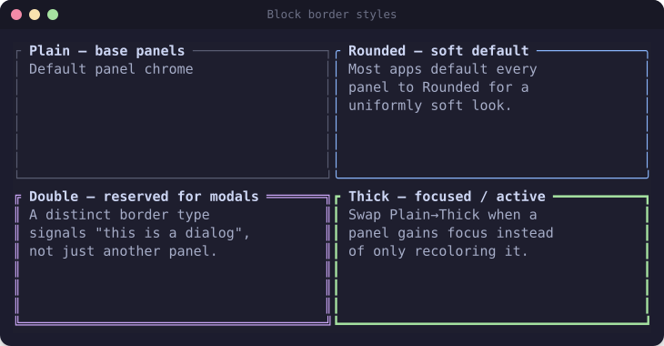

```rust
Block::bordered()
    .border_type(BorderType::Rounded)          // Plain | Rounded | Double | Thick | QuadrantInside...
    .border_style(Style::new().fg(theme.border))
    .title(Span::styled(" Services ", Style::new().fg(theme.text).bold()))
    .title_alignment(Alignment::Left)
    .padding(Padding::horizontal(1))
    .style(Style::new().bg(theme.base))        // fills the whole block area, not just the border
```

`block.inner(area)` gives you the content `Rect` after borders/padding are subtracted — always
render children into `block.inner(area)`, then `frame.render_widget(block, area)` (block first,
so children paint on top — order in the render call doesn't matter for `Block` itself since it
only touches the border cells, but get in the habit).

## List — selection, icons, highlight symbol

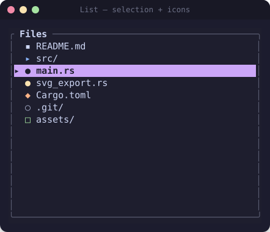

```rust
let items: Vec<ListItem> = entries.iter().map(|e| {
    ListItem::new(Line::from(vec![
        Span::styled(format!("{} ", e.icon), Style::new().fg(e.color)),
        Span::styled(&e.name, Style::new().fg(theme.text)),
    ]))
}).collect();

let list = List::new(items)
    .block(block)
    .highlight_symbol("▸ ")
    .highlight_style(Style::new().fg(theme.base).bg(theme.accent).bold());

let mut state = ListState::default();
state.select(Some(index));
frame.render_stateful_widget(list, area, &mut state);
```

Use plain single-width Unicode symbols (`▪ ▸ ● ◆ ○ □ ★`) for icons rather than Nerd Font
private-use-area glyphs — Nerd Font icons only render in a terminal configured with a patched
font, so copy-pasted output / screenshots / this very file look like tofu boxes everywhere else.
`xplr` layers a *second*, independent cue (`▸` focus prefix vs `{...}` selection brackets) so
focus and multi-selection stay visually distinguishable even on the same row — worth stealing
for any list with both concepts.

## Table — header + row styling

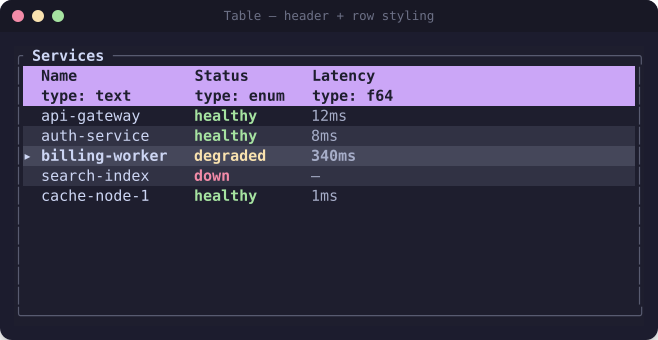

```rust
let header = Row::new(vec![
    Cell::from("Name\ntype: text"),   // \n in a Cell makes it two lines — free column metadata
    Cell::from("Status\ntype: enum"),
]).style(Style::new().fg(theme.base).bg(theme.accent).bold()).height(2);

let rows = data.iter().enumerate().map(|(i, row)| {
    let bg = if i % 2 == 0 { theme.base } else { theme.surface0 }; // alternating rows
    Row::new(vec![Cell::from(row.name.as_str()), /* ... */]).style(Style::new().bg(bg))
});

Table::new(rows, [Constraint::Length(16), Constraint::Length(12)])
    .header(header)
    .row_highlight_style(Style::new().bg(theme.surface1).bold()) // NOT `.highlight_style` (deprecated)
    .highlight_symbol("▸ ")
```

Only apply the row-highlight style when the table is actually focused
(`if is_focused { highlight_style } else { Style::default() }`) — a highlight that's always on
reads as "everything is selected," not "this row is selected."

## Tabs — icons + highlight

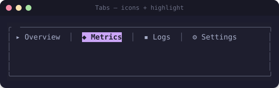

```rust
Tabs::new(["▸ Overview", "◆ Metrics", "▪ Logs", "⚙ Settings"])
    .block(Block::bordered().border_type(BorderType::Rounded))
    .highlight_style(Style::new().fg(theme.base).bg(theme.accent).bold())
    .select(selected_index)
    .divider(Span::styled("│", Style::new().fg(theme.border)))
    .padding(" ", " ")
```

## Gauge, LineGauge, Sparkline

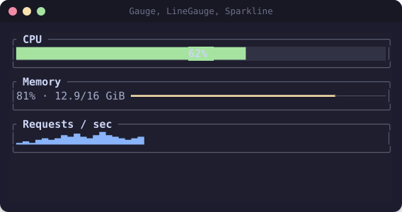

```rust
Gauge::default()
    .block(block)
    .gauge_style(Style::new().fg(theme.green).bg(theme.surface0))
    .label(Span::styled("62%", Style::new().fg(theme.text).bold())) // see pitfall below
    .ratio(0.62);

LineGauge::default()
    .filled_style(Style::new().fg(theme.yellow))
    .unfilled_style(Style::new().fg(theme.surface1))
    .filled_symbol("━").unfilled_symbol("─")   // `.line_set(...)` is deprecated in current ratatui
    .ratio(0.81);

Sparkline::default().data(&samples).style(Style::new().fg(theme.blue));
```

**Pitfall:** `Gauge`'s label is centered and painted over *both* the filled and unfilled portion
of the bar using a single `Style` — if you give the label a dark/near-black fg (assuming it'll
sit on the filled color), the half of the label over the *unfilled* background becomes
low/no-contrast and disappears. Use a label color that reads on both the filled and unfilled
background (a light neutral like the theme's main text color is the safe default), or don't
override the label at all and let it inherit `gauge_style`.

`Gauge` is really "a labeled proportion," not only "progress" — `minesweep-rs` repurposes it as
a flag counter. For sub-cell precision (smoother than one `Gauge` character = one percentage
point), `dua` renders bars from `symbols::block::{ONE_EIGHTH..FULL}` directly — see
`reference/aesthetics.md` §5.

## BarChart

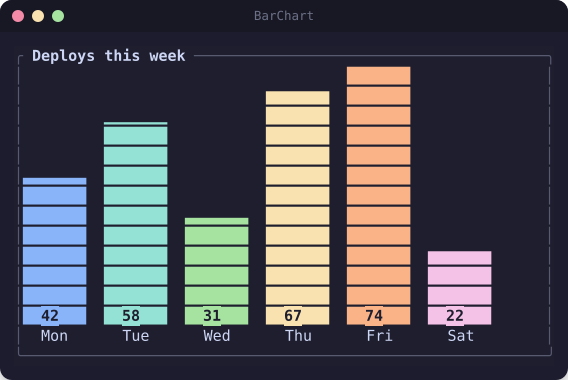

```rust
let bars: Vec<Bar> = data.iter().map(|(label, value)| {
    Bar::default().label(Line::from(*label)).value(*value).text_value(value.to_string())
        .style(Style::new().fg(color_for(label)))
}).collect();

BarChart::default().block(block).data(BarGroup::new(bars)).bar_width(7).bar_gap(2)
```

`BarChart::default().data(...)` accepts anything `Into<BarGroup>`, including
`&[(&str, u64)]` directly for the simple single-group case. Use `BarChart::horizontal(...)` for
a horizontal orientation, `BarChart::grouped(groups)` for multiple side-by-side groups (e.g. one
group per day, one bar per server within it).

## Chart — line/scatter with axes

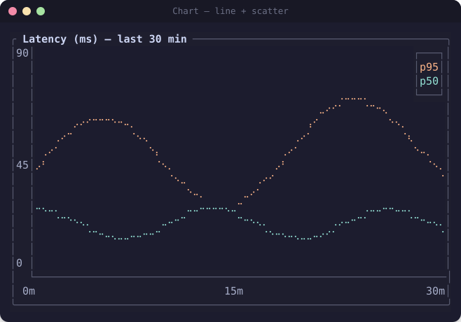

```rust
let datasets = vec![
    Dataset::default().name("p95").marker(symbols::Marker::Braille)
        .graph_type(GraphType::Line).style(Style::new().fg(theme.peach)).data(&p95_points),
];
Chart::new(datasets)
    .block(block)
    .x_axis(Axis::default().bounds([0.0, 29.0]).labels(["0m", "15m", "30m"]))
    .y_axis(Axis::default().bounds([0.0, 90.0]).labels(["0", "45", "90"]))
    .legend_position(Some(LegendPosition::TopRight))
```

`symbols::Marker::Braille` gives roughly 2x4 sub-cell resolution per character cell — always
prefer it over `Marker::Dot`/`Marker::Block` for line/scatter data; the latter look chunky at
typical terminal sizes. `scope-tui`'s entire real-time oscilloscope is stock `Chart` + `Dataset`
+ `Axis` redrawn on every audio buffer — no custom widget needed even for "looks like a real
instrument" results.

## Canvas — arbitrary vector drawing

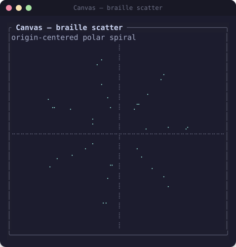

```rust
Canvas::default()
    .block(block)
    .marker(symbols::Marker::Braille)
    .x_bounds([-12.0, 12.0])
    .y_bounds([-12.0, 12.0])
    .paint(|ctx| {
        ctx.draw(&Points { coords: &points, color: theme.teal });
        ctx.draw(&Line { x1: -12.0, y1: 0.0, x2: 12.0, y2: 0.0, color: theme.border });
        ctx.print(-11.5, 11.0, Line::from(Span::styled("label", Style::new().fg(theme.subtext))));
    });
```

Also available: `Rectangle`, `Circle`, and (feature-gated) `Map` with `MapResolution` for a
built-in world map outline — `trippy` draws a live per-hop GeoIP world map this way. Bounds are
world coordinates you choose; ratatui maps them to the braille sub-cell grid for you, so your
drawing code never thinks in terminal cells.

## Calendar (feature `widget-calendar`)

Not included in the pre-rendered gallery (needs the `time` crate), but available via
`ratatui::widgets::calendar::{Monthly, CalendarEventStore}` with `all-widgets` or
`widget-calendar` enabled. `Monthly::new(date, event_store)` renders a single month grid;
`CalendarEventStore` maps individual `time::Date`s to a `Style` for highlighting (e.g. marking
due dates). `taskwarrior-tui` hand-rolls a *multi*-month calendar instead
(`reference/showcase-apps.md` §4) when a single month isn't enough context.

## Paragraph — styled spans + wrapping

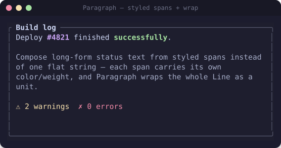

```rust
let text = Text::from(vec![
    Line::from(vec![
        Span::styled("Deploy ", Style::new().fg(theme.text)),
        Span::styled("#4821", Style::new().fg(theme.accent).bold()),
        Span::styled(" succeeded", Style::new().fg(theme.green).bold()),
    ]),
]);
Paragraph::new(text).block(block).wrap(Wrap { trim: true })
```

Compose long-form status text from styled `Span`s inside a `Line`, not one flat string with ANSI
codes spliced in by hand. `Paragraph::scroll((y, x))` gives vertical *and* horizontal scroll, but
only integer-line granularity and no independent state object — for anything scrollable with
richer needs (search-jump, mouse drag), pair it with `Scrollbar`/`ScrollbarState` (below) or use
gitui's hand-rolled `StatefulParagraph` pattern (`reference/showcase-apps.md` §4).

## Scrollbar

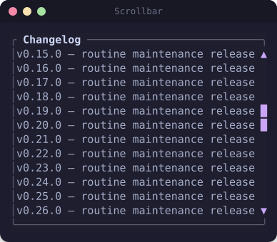

```rust
let mut state = ScrollbarState::new(total_lines).position(scroll_offset);
let scrollbar = Scrollbar::new(ScrollbarOrientation::VerticalRight)
    .symbols(symbols::scrollbar::Set { track: " ", thumb: "█", begin: "▲", end: "▼" })
    .style(Style::new().fg(theme.accent));
frame.render_stateful_widget(scrollbar, area.inner(Margin { vertical: 1, horizontal: 0 }), &mut state);
```

Inset the scrollbar's render area by 1 vertical margin (as above) so the thumb doesn't collide
with the block's corner border glyphs — `oatmeal`, `dua`, and `rainfrog` all do this. `rainfrog`
runs *dual* scrollbars (vertical + horizontal) on the same table for full 2-D scrolling.

## Clear — required for popups

`Clear` isn't visual on its own; render it into a popup's area *before* the popup's own block so
the panel underneath doesn't bleed through the "transparent" cells ratatui would otherwise leave
alone. See `reference/aesthetics.md` §3 for the full centered-popup pattern.

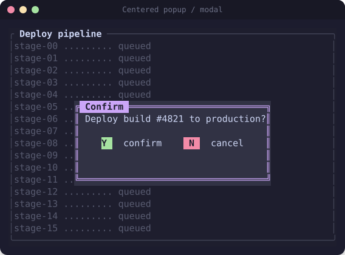
