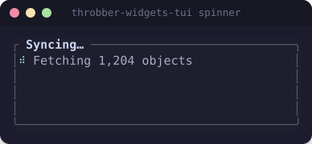
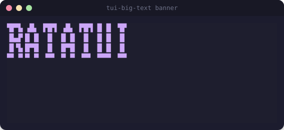
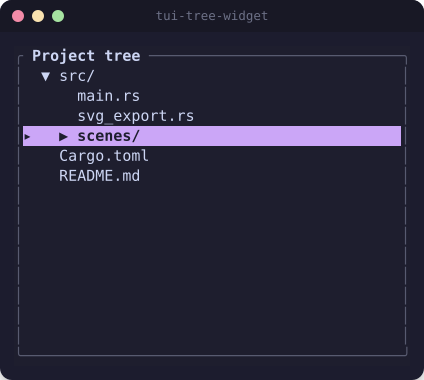

# Third-party widget crates

Ratatui's own crate deliberately stays minimal; a healthy ecosystem covers everything else.
Reach for these before hand-rolling — three of them (`tui-big-text`, `throbber-widgets-tui`,
`tui-tree-widget`) are wired into `examples/` with working demos and SVGs.

## Demoed in this skill

### throbber-widgets-tui — spinners



```rust
let throbber = throbber_widgets_tui::Throbber::default()
    .label("Fetching 1,204 objects")
    .throbber_style(Style::new().fg(theme.teal).bold())
    .throbber_set(throbber_widgets_tui::BRAILLE_SIX)   // several animation sets available
    .use_type(throbber_widgets_tui::WhichUse::Spin);
let mut state = throbber_widgets_tui::ThrobberState::default();
// on each tick: state.calc_next();
frame.render_stateful_widget(throbber, area, &mut state);
```

Saves hand-rolling the classic `['⠋','⠙','⠹','⠸','⠼','⠴','⠦','⠧','⠇','⠏']` frame-array-on-a-timer
that `gitui` and `oxker` both implement from scratch — reach for the crate unless you need a
fully custom symbol set (`chess-tui` does, for a `CHESS_SET` throbber).

### tui-big-text — pixel-font banners



```rust
let big = tui_big_text::BigTextBuilder::default()
    .pixel_size(tui_big_text::PixelSize::Quadrant)  // Full | HalfHeight | HalfWidth | Quadrant
    .style(Style::new().fg(theme.accent))
    .lines(vec![Line::from("RATATUI")])
    .build();
frame.render_widget(big, area);
```

Renders block-character glyphs from the `font8x8` font. Good for splash screens and large
numeric displays (`binsider` pairs it with an ANSI-art logo widget for a genuinely designed
splash screen — see `reference/showcase-apps.md`).

### tui-tree-widget — hierarchical data



```rust
let items = vec![
    TreeItem::new("src", "src/", vec![
        TreeItem::new_leaf("main", "main.rs"),
    ]).unwrap(),
    TreeItem::new_leaf("cargo", "Cargo.toml"),
];
let mut state = TreeState::default();
state.open(vec!["src"]);           // path of identifiers, not indices
state.select(vec!["src", "main"]);

let tree = Tree::new(&items).unwrap()
    .highlight_style(Style::new().fg(theme.base).bg(theme.accent).bold())
    .highlight_symbol("▸ ");
frame.render_stateful_widget(tree, area, &mut state);
```

Identifiers (not display text) key open/select state, so re-sorting/filtering the underlying
data doesn't desync selection the way index-based state would.

## Not demoed, but worth knowing about

| Crate | Use it for |
|---|---|
| `tui-textarea` (or `ratatui-textarea`) | Full multi-line editable text area — wrapping, scrolling, cursor, undo built in. `oatmeal` uses it for its chat input box. Reach for this instead of hand-rolling a text field the moment you need more than a single line. |
| `tui-input` | Lighter-weight single-line input state (cursor, insert, backspace) when a full textarea is overkill — used by `binsider`, `csvlens`, `openapi-tui`. |
| `ratatui-image` | Real raster image rendering via terminal graphics protocols (sixel, iTerm2, Kitty) with an ASCII-art fallback when the terminal doesn't support any of them. `joshuto` uses it for file previews. |
| `tui-scrollview` | A scrollable viewport for arbitrary widget content, when `Paragraph::scroll`/manual `Scrollbar` bookkeeping isn't enough. |
| `tui-logger` | A ready-made log-viewer widget/target — pairs with `tracing`/`log` so you get a live in-app log pane instead of (or in addition to) a log file, without building the ring-buffer-plus-widget yourself. |
| `tui-menu` | Nestable popup/dropdown menus. |
| `tui-widget-list` | A stateful list that holds arbitrary heterogeneous widgets per row (not just styled text), when `List`/`ListItem` is too restrictive. |
| `tui-checkbox` | Styled checkbox widget (Unicode/emoji/ASCII symbol sets). |
| `tui-nodes` | Node-graph / flow-diagram visualization. |
| `tui-piechart` | Pie charts, standard and high-resolution. |
| `tui-term` | Embed a real pseudoterminal (running another program) as a widget inside your TUI. |
| `ansi-to-tui` | Parse raw ANSI-escaped text (subprocess output, a stored ASCII-art logo, syntax-highlighter output) into styled ratatui `Text`. Used by 5 of the 22 showcase apps for exactly this. |
| `color-eyre` + `human-panic` | Panic hook that restores the terminal before printing a pretty report — see `reference/concepts.md`'s panic-safety section. Treat as close to mandatory. |
| `syntect` | Real Sublime-Text-grammar syntax highlighting for diffs/code/JSON — used by `gitui`, `oatmeal`, `openapi-tui`. |

When nothing off-the-shelf fits, implementing `Widget`/`StatefulWidget` yourself and writing
straight into buffer cells is completely normal in this ecosystem — see
`reference/showcase-apps.md` §4 for eight real examples worth studying before you design your
own (gauge variants, off-screen-buffer blit-scrolling, hand-drawn T-junction borders, etc.).
